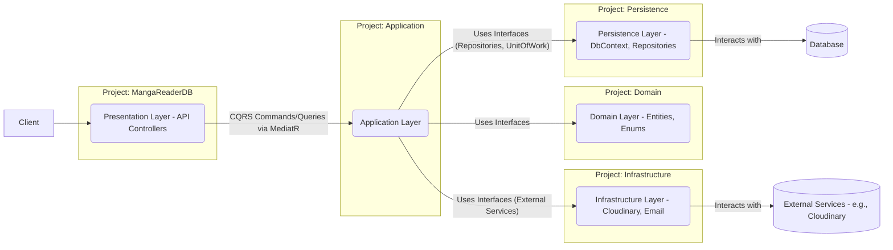

# Kiến Trúc Hệ Thống MangaReader API

Dự án MangaReader API được xây dựng dựa trên các nguyên tắc của Domain-Driven Design (DDD) và kiến trúc phân tầng rõ ràng (Clean Architecture) để đảm bảo tính module, dễ bảo trì và mở rộng.

## 1. Các Tầng Chính

Hệ thống được chia thành các tầng logic chính sau:

*   **Domain Layer (`Domain/`)**:
    *   Là trái tim của ứng dụng, chứa business logic cốt lõi.
    *   Bao gồm:
        *   **Entities**: Các đối tượng nghiệp vụ chính (ví dụ: `Manga`, `Chapter`, `Author`). Các entities này có thể chứa logic để tự quản lý trạng thái và tuân thủ các quy tắc nghiệp vụ.
        *   **Enums**: Các kiểu liệt kê sử dụng trong domain (ví dụ: `MangaStatus`, `ContentRating`).
        *   **Value Objects**: (Nếu có) Các đối tượng giá trị không có định danh riêng.
        *   **Domain Events**: (Nếu có) Các sự kiện xảy ra trong domain.
    *   **Không** phụ thuộc vào bất kỳ tầng nào khác.
    *   **Không** chứa logic liên quan đến cơ sở dữ liệu (EF Core), DTOs, hoặc các thành phần của Application/Infrastructure layer.

*   **Application Layer (`Application/`)**:
    *   Điều phối các use cases của ứng dụng.
    *   Sử dụng **MediatR** để triển khai mô hình CQRS (Command Query Responsibility Segregation), tách biệt logic ghi (Commands) và đọc (Queries).
        *   **Commands**: Xử lý các yêu cầu thay đổi dữ liệu (Create, Update, Delete). Command Handlers chứa logic nghiệp vụ, tương tác với Repositories và các Services.
        *   **Queries**: Xử lý các yêu cầu đọc dữ liệu. Query Handlers tương tác với Repositories và map Entities sang DTOs.
    *   Định nghĩa **Data Transfer Objects (DTOs)** (`Application/Common/DTOs/`) để truyền dữ liệu giữa Presentation Layer và Application Layer.
    *   Định nghĩa **Interfaces (Contracts)** (`Application/Contracts/`) cho Repositories (ví dụ: `IMangaRepository`, `IUnitOfWork`) và các dịch vụ bên ngoài (ví dụ: `IPhotoAccessor`).
    *   Sử dụng **FluentValidation** (`Application/Features/.../...Validator.cs` và `Application/Validation/...`) để validate DTOs, Commands, và Queries.
    *   Sử dụng **AutoMapper** (`Application/Common/Mappings/`) để map giữa Entities và DTOs.
    *   **Không** chứa logic truy cập trực tiếp vào `DbContext`. Thay vào đó, sử dụng các Repository Interfaces.
    *   Phụ thuộc vào Domain Layer.

*   **Persistence Layer (`Persistence/`)**:
    *   Chịu trách nhiệm về việc lưu trữ và truy xuất dữ liệu.
    *   Triển khai `ApplicationDbContext` (kế thừa từ `DbContext` của EF Core và implement `IApplicationDbContext`).
    *   Triển khai các **Repository Interfaces** đã định nghĩa trong Application Layer (ví dụ: `MangaRepository`, `AuthorRepository`).
    *   Triển khai **Unit of Work pattern** (`UnitOfWork.cs`) để quản lý transactions và đảm bảo tính nhất quán dữ liệu.
    *   Chứa tất cả logic truy vấn EF Core (LINQ to Entities).
    *   Chứa các **Interceptors** liên quan đến EF Core (ví dụ: `AuditableEntitySaveChangesInterceptor` để tự động cập nhật `CreatedAt`, `UpdatedAt`).
    *   Quản lý **EF Core Migrations**.
    *   Phụ thuộc vào Domain Layer và Application Layer (để implement interfaces).

*   **Infrastructure Layer (`Infrastructure/`)**:
    *   Cung cấp các triển khai cụ thể cho các dịch vụ bên ngoài hoặc các mối quan tâm xuyên suốt không thuộc về business logic cốt lõi.
    *   Triển khai các Interface từ Application Layer cho các dịch vụ bên ngoài (ví dụ: `PhotoAccessor` triển khai `IPhotoAccessor` cho Cloudinary).
    *   Chứa cấu hình và logic tương tác với các dịch vụ bên thứ ba (email, hệ thống file, message queues, v.v.).
    *   Phụ thuộc vào Application Layer (để implement interfaces).

*   **Presentation Layer (`MangaReaderDB/` - API Layer)**:
    *   Là điểm vào của ứng dụng, tiếp nhận các HTTP requests và trả về HTTP responses.
    *   Chứa các **API Controllers**.
    *   Controllers chịu trách nhiệm:
        *   Nhận HTTP requests.
        *   Validate DTOs đầu vào (sử dụng FluentValidation Validators đã được inject).
        *   Chuẩn bị dữ liệu đầu vào cho Commands/Queries (ví dụ: chuyển `IFormFile` thành `Stream`).
        *   Gửi Commands/Queries đến MediatR.
        *   Xử lý kết quả từ MediatR và trả về HTTP responses phù hợp (sử dụng DTOs từ Application Layer).
    *   **Không** chứa business logic hoặc logic truy cập dữ liệu trực tiếp.
    *   Phụ thuộc vào Application Layer và Infrastructure Layer (ví dụ: để inject `IPhotoAccessor` nếu cần xử lý file trước khi gửi vào command).

## 2. Luồng Tương Tác Chính

1.  **Request Handling (CQRS):**
    *   Client gửi HTTP Request đến API Controller.
    *   Controller validate DTO (nếu có payload) và tạo Command/Query tương ứng.
    *   Controller gửi Command/Query đến MediatR.
    *   MediatR tìm và thực thi Handler tương ứng trong Application Layer.
    *   Handler xử lý logic:
        *   **Command Handler**: Tương tác với `IUnitOfWork` (và các Repositories), `IPhotoAccessor` (nếu cần), thực hiện thay đổi dữ liệu, sau đó gọi `_unitOfWork.SaveChangesAsync()`.
        *   **Query Handler**: Tương tác với `IUnitOfWork` (và các Repositories) để lấy dữ liệu, map Entities sang DTOs bằng AutoMapper.
    *   Handler trả kết quả (DTO, ID, Unit,...) về Controller.
    *   Controller trả HTTP Response cho Client.

2.  **Database Interactions:**
    *   Mọi tương tác với cơ sở dữ liệu đều thông qua Repositories và Unit of Work trong Persistence Layer.
    *   Sử dụng EF Core Code-First, schema được quản lý bằng Migrations.
    *   `AuditableEntitySaveChangesInterceptor` tự động cập nhật các trường `CreatedAt` và `UpdatedAt`.

Sơ đồ trực quan (mermaid):

## 3. Nguyên Tắc Thiết Kế

*   **Single Responsibility Principle (SRP)**: Mỗi class/module có một trách nhiệm duy nhất.
*   **Dependency Inversion Principle (DIP)**: Các module cấp cao không phụ thuộc vào module cấp thấp, mà phụ thuộc vào abstractions. Abstractions không phụ thuộc vào details, details phụ thuộc vào abstractions.
*   **Async Everywhere**: Sử dụng `async/await` cho các thao tác I/O.
*   **Code-First Database**: Schema được quản lý bởi EF Core Migrations.
*   **Unit of Work Pattern**: Đảm bảo tính toàn vẹn giao dịch khi ghi dữ liệu. 