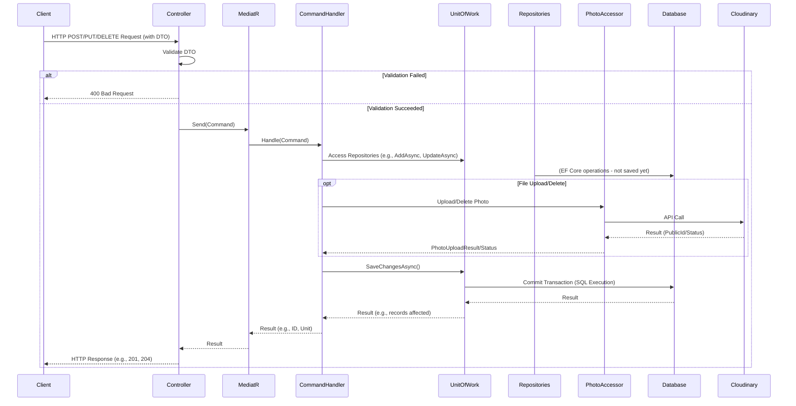

# Luồng Dữ Liệu Chính

Tài liệu này mô tả các luồng dữ liệu quan trọng trong hệ thống MangaReader API.

## 1. Luồng Xử Lý Request Tổng Quát (CQRS)

1.  **Client (Frontend/Mobile App/Tool)**: Gửi một HTTP request (GET, POST, PUT, DELETE) đến một endpoint của API.
2.  **API Controller (`MangaReaderDB/Controllers/`)**:
    *   Tiếp nhận request.
    *   Binding và validation DTO đầu vào (nếu có) sử dụng FluentValidation.
    *   Tạo một đối tượng **Command** (cho các tác vụ ghi CUD) hoặc **Query** (cho các tác vụ đọc R).
    *   Gửi Command/Query đến **MediatR**.
3.  **MediatR (`Application/`)**:
    *   Tìm và kích hoạt **Handler** tương ứng với Command/Query đã nhận.
4.  **Command/Query Handler (`Application/Features/.../`)**:
    *   **Command Handler**:
        *   Thực hiện logic nghiệp vụ.
        *   Tương tác với **`IUnitOfWork`** để truy cập các **Repositories** (ví dụ: `_unitOfWork.MangaRepository.AddAsync(manga)`).
        *   Nếu có thao tác với file (ví dụ: upload ảnh), Handler sẽ gọi các phương thức của **`IPhotoAccessor`**.
        *   Sau khi tất cả các thao tác dữ liệu hoàn tất, gọi `_unitOfWork.SaveChangesAsync()` để commit transaction.
        *   Trả về kết quả (ví dụ: ID của entity mới tạo, `Unit` của MediatR, hoặc DTO).
    *   **Query Handler**:
        *   Tương tác với **`IUnitOfWork`** để truy cập các **Repositories** nhằm lấy dữ liệu từ database.
        *   Sử dụng **AutoMapper** để map Entities sang DTOs.
        *   Trả về DTOs.
5.  **Unit of Work & Repositories (`Persistence/Repositories/`)**:
    *   **Repositories**: Thực thi các truy vấn LINQ to Entities lên `ApplicationDbContext`.
    *   **`ApplicationDbContext`**: Tương tác với cơ sở dữ liệu SQL Server.
    *   **`AuditableEntitySaveChangesInterceptor`**: Tự động cập nhật `CreatedAt`, `UpdatedAt` trước khi `SaveChangesAsync` được thực thi.
6.  **External Services (ví dụ: Cloudinary qua `Infrastructure/Photos/`)**:
    *   `IPhotoAccessor` (triển khai bởi `PhotoAccessor`) tương tác với dịch vụ Cloudinary để upload hoặc xóa ảnh.
7.  **API Controller**:
    *   Nhận kết quả từ MediatR Handler.
    *   Xây dựng và trả về HTTP Response (ví dụ: 200 OK với DTO, 201 Created với location header, 204 NoContent, 400 Bad Request, 404 Not Found).

Sơ đồ luồng xử lý Command:

## 2. Luồng Upload Ảnh (ví dụ: Cover Art)

1.  **Client**: Người dùng chọn ảnh bìa và các thông tin metadata (volume, description) và gửi request (thường là `multipart/form-data`) đến endpoint `POST /api/mangas/{mangaId}/covers`.
2.  **`CoverArtsController`**:
    *   Nhận `IFormFile` (ảnh) và các metadata từ `[FromForm]`.
    *   Validate file (kích thước, loại file).
    *   Validate metadata (sử dụng `CreateCoverArtDtoValidator`).
    *   Mở `Stream` từ `IFormFile` và lấy `OriginalFileName`, `ContentType`.
    *   Tạo `UploadCoverArtImageCommand` với `MangaId`, `Stream`, `OriginalFileName`, `ContentType`, và các metadata.
    *   Gửi command đến MediatR.
3.  **`UploadCoverArtImageCommandHandler`**:
    *   Inject `IUnitOfWork` và `IPhotoAccessor`.
    *   Kiểm tra `MangaId` có tồn tại không.
    *   Tạo `desiredPublicId` cho Cloudinary (ví dụ: `mangas_v2/{MangaId}/covers/{Volume}_{UniqueId}{FileExtension}`).
    *   Gọi `_photoAccessor.UploadPhotoAsync(stream, desiredPublicId, originalFileName)`.
    *   Nếu upload lên Cloudinary thành công, nhận `PhotoUploadResult` (chứa `PublicId` và `Url`).
    *   Tạo một entity `CoverArt` mới, gán `MangaId`, các metadata, và `PublicId` nhận được từ Cloudinary.
    *   Sử dụng `_unitOfWork.CoverArtRepository.AddAsync(coverArtEntity)`.
    *   Gọi `_unitOfWork.SaveChangesAsync()` để lưu `CoverArt` entity vào database.
    *   Trả về `CoverId` của `CoverArt` entity mới tạo.
4.  **`CoverArtsController`**:
    *   Nhận `CoverId`.
    *   Trả về HTTP 201 Created với location header trỏ đến endpoint `GET /api/coverarts/{coverId}` và payload chứa `CoverId`.
5.  **Client (Hiển thị ảnh)**:
    *   Khi cần hiển thị ảnh bìa, client gọi API để lấy thông tin Manga (bao gồm danh sách `CoverArtDto`).
    *   API (ví dụ: `GetMangaByIdQueryHandler`) trả về `MangaDto` chứa danh sách `CoverArtDto`, mỗi `CoverArtDto` có trường `PublicId`.
    *   Client sử dụng `PublicId` này và `CloudName` (đã cấu hình ở client) để xây dựng URL đầy đủ của ảnh trên Cloudinary, có thể kèm theo các transformation.

## 3. Luồng Xóa Ảnh (khi xóa Entity liên quan)

1.  **Ví dụ**: Xóa một `Chapter` (sẽ cascade xóa `ChapterPages`).
2.  **`DeleteChapterCommand`** được gửi đến MediatR.
3.  **`DeleteChapterCommandHandler`**:
    *   Lấy `Chapter` entity cùng với danh sách `ChapterPages` của nó (`GetChapterWithPagesAsync`).
    *   Với mỗi `ChapterPage` có `PublicId`:
        *   Gọi `_photoAccessor.DeletePhotoAsync(page.PublicId)` để xóa ảnh khỏi Cloudinary.
        *   Log lỗi nếu xóa trên Cloudinary không thành công, nhưng thường không dừng quy trình.
    *   Gọi `_unitOfWork.ChapterRepository.DeleteAsync(chapterToDelete)`. (EF Core Cascade Delete sẽ xử lý việc xóa các `ChapterPage` entities).
    *   Gọi `_unitOfWork.SaveChangesAsync()`.
    *   Trả về `Unit`. 